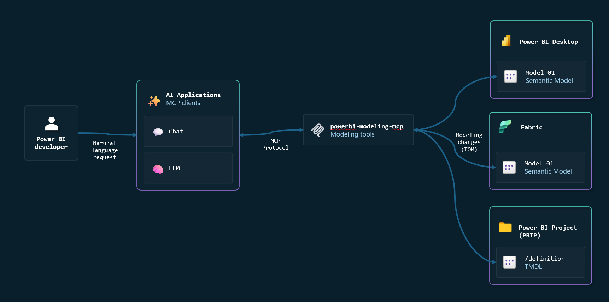
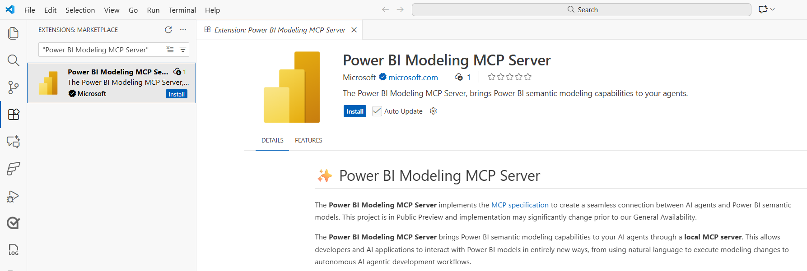
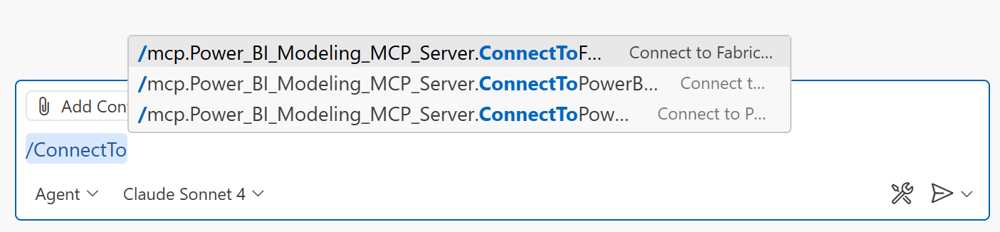

# ✨ Power BI Modeling MCP Server

The **Power BI Modeling MCP Server** implements the [MCP specification](https://modelcontextprotocol.io/introduction) to create a seamless connection between AI agents and Power BI semantic models. This project is in Public Preview and implementation may significantly change prior to our General Availability.

The **Power BI Modeling MCP Server** brings Power BI semantic modeling capabilities to your AI agents through a **local MCP server**. This allows developers and AI applications to interact with Power BI models in entirely new ways, from using natural language to execute modeling changes to autonomous AI agentic development workflows.



## 💡 What can you do?

- **🔄 Build and Modify Semantic Models with Natural Language** - Tell your AI assistant what you need, and it uses this MCP server to create, update, and manage tables, columns, measures, relationships, and more... across Power BI Desktop and Fabric semantic models.

- **⚡ Bulk Operations at Scale** - AI applications can execute batch modeling operations on hundreds of objects simultaneously — bulk renaming, bulk refactoring, model translations, or model security rules - with transaction support and error handling, turning hours of repetitive work into seconds.

- **✅ Apply modeling best practices** - Easily evaluate and implement modeling best practices against your model.

- **🤖 Agentic Development Workflows** - Supports working with [TMDL and Power BI Project files](https://learn.microsoft.com/power-bi/developer/projects/projects-dataset#tmdl-format), enabling AI agents to autonomously plan, create, and execute complex modeling tasks across your semantic model codebase.

- **🔍 Query and Validate DAX** - AI assistants can execute and validate DAX queries against your model, helping you test measures, troubleshoot calculations, and explore your data

📹 Watch the video for an [end-to-end demo](https://youtu.be/n9JaxHDQIqo?si=U-lUeuJRN-Q5gVM2).

> [!WARNING]  
> - Use caution when connecting an AI Agent to a semantic model. The underlying LLM may produce unexpected or inaccurate results, which could lead to unintended changes. **Always create a backup of your model before performing any operations.** 
> - LLMs might unintentionally expose sensitive information from the semantic model, including data or metadata, in logs or responses. **Exercise caution when sharing chat sessions.**
> - The **Power BI Modeling MCP server** can only execute modeling operations. It cannot modify other types of Power BI metadata, such as report pages or semantic model elements like diagram layouts.

## 📦 Installation

The easiest way to install this MCP Server is by using the **Visual Studio Code extension** extension together with **GitHub Copilot**. However, you can also manually install it in any other MCP client.

### Visual Studio Code (Recommended)

1. Install [Visual Studio Code](https://code.visualstudio.com/download).
2. Install the [GitHub Copilot](https://marketplace.visualstudio.com/items?itemName=GitHub.copilot) and [GitHub Copilot Chat](https://marketplace.visualstudio.com/items?itemName=GitHub.copilot-chat) extensions.
3. Install the [Power BI Modeling MCP Visual Studio Code extension](https://marketplace.visualstudio.com).
   
	

4. Open [GitHub Copilot chat](https://code.visualstudio.com/docs/copilot/chat/copilot-chat) and confirm the **Power BI Modeling MCP server** is available and selected.
   
	

### Manual install

This MCP Server can also be configured across other IDEs, CLIs, and MCP clients:

1. Download the latest version [here](../../releases/latest).
2. Unzip the contents to a folder of your choice, for example: `C:\MCPServers\PowerBIModelingMCP`
3. Run `\extension\server\powerbi-modeling-mcp.exe`
4. Copy the MCP JSON registration from the console and register it in your preferred MCP client tool.

Example of config that should work in most MCP clients:

```json
{
"servers": {
		"powerbi-modeling-mcp": {
			"type": "stdio",
			"command": "C:\\MCPServers\\PowerBIModelingMCP\\extension\\server\\powerbi-modeling-mcp.exe",
			"args": [
				"--start"                
			],
			"env": {}			
		}
	}
}
```

## 🚀 Get started

**First, you must connect to a Power BI semantic model**, which can reside in Power BI Desktop, Fabric workspace or in Power BI Project (PBIP) files.

- **For Power BI Desktop:** 

	```
	Connect to '[File Name]' in Power BI Desktop
	```

- **For Semantic Model in Fabric Workspace:**

	```
	Connect to semantic model '[Semantic Model Name]' in Fabric Workspace '[Workspace Name]'
	```
  
- **For Power BI Project files:**

	```
	Open semantic model from PBIP folder '[Path to the definition/ TMDL folder in the PBIP]'
	```

Once the connection is established, you can use natural language to ask the AI agent to make any modeling changes. To get started, try one of the following scenarios.

### Example scenarios


| Scenario                                                | Prompt examples                                                                                                                                                                                                                                                                                                                                                                                        |
| ------------------------------------------------------- | ------------------------------------------------------------------------------------------------------------------------------------------------------------------------------------------------------------------------------------------------------------------------------------------------------------------------------------------------------------------------------------------------------ |
| Analyze naming convention and bulk rename.              | `Analyze my model’s naming conventions and suggest renames to ensure consistency.`<br>`Analyze the naming convention of the ‘Sales’ table and apply the same pattern across the entire model.`                                                                                                                                                                                                         |
| Set descriptions across your model for documentation.   | `Add descriptions to all measures, columns, and tables to clearly explain their purpose and explain the logic behind the DAX code in simple, understandable terms.`                                                                                                                                                                                                                                    |
| Translate your semantic model.                          | `Generate a French translation for my model including tables, columns and measures.`                                                                                                                                                                                                                                                                                                                   |
| Refactor measures into Calculation Groups or UDF.       | `Refactor measures 'Sales Amount 12M Avg' and 'Sales Amount 6M Avg' into a calculation group and include new variants: 24M and 3M.`                                                                                                                                                                                                                                                                    |
| Refactor your queries to use semantic model parameters. | `Analyze the Power Query code for all tables, identify the data source configuration, and create semantic model parameters to enable easy switching of the data source location.`                                                                                                                                                                                                                      |
| Benchmark DAX queries against multiple models.          | `Connect to semantic model 'V1' and 'V2. And benchmark the following DAX query against both models. [DAX Query] `                                                                                                                                                                                                                                                                                      |
| Document your semantic model                            | `Generate a Markdown document (.md) that provides complete, professional documentation for a Power BI Semantic Model. Use a simple mermaid diagram to ilustrate the table relationships; Document each measure including the DAX code and a description of the business logic using business friendly names; Document row level filters; Document the data sources by analyzing the Power Query code.` |

> [!TIP]
> The scenarios above are just examples. This MCP server equips your agents with modeling tools for any type of model change, and with the right prompt and context, you can automate virtually any modeling task.

### Confirmation prompts

This MCP Server supports the [Elicitation MCP protocol](https://modelcontextprotocol.io/specification/2025-06-18/client/elicitation), requiring user approval for the following actions:

- Before the first modification made to a semantic model.
- Before the first query executed against a semantic model.


> [!TIP]
> You can configure the MCP to skip these confirmations by using the `--skipconfirmation` option. 

## 🛠️ Available tools

| Tool Name                               | What It Does                                                                                                   |
| --------------------------------------- | -------------------------------------------------------------------------------------------------------------- |
| **connection_operations**               | Connect to Power BI Desktop or Fabric workspaces                                                               |
| **database_operations**                 | Manage semantic models - connect, create, update, list databases, import/export TMDL folders, deploy to Fabric |
| **transaction_operations**              | Control database transactions (begin, commit, rollback, get status)                                            |
| **model_operations**                    | Work with the overall model (get info, create, update, refresh, get stats, rename)                             |
| **table_operations**                    | Manage tables (create, update, delete, get, list, refresh, rename)                                             |
| **column_operations**                   | Manage individual table columns (create, update, delete, get, list, rename)                                    |
| **measure_operations**                  | Manage individual DAX measures (create, update, delete, get, list, rename, move between tables)                |
| **relationship_operations**             | Handle relationships between tables (create, update, delete, activate/deactivate, find)                        |
| **dax_query_operations**                | Execute, validate, and generate DAX queries against the model                                                  |
| **trace_operations**                    | Perform trace operations on semantic model to capture and analyze Analysis Services events.                    |
| **partition_operations**                | Manage table partitions (create, update, delete, refresh specific partitions)                                  |
| **user_hierarchy_operations**           | Work with user-defined hierarchies (create, update, delete levels, reorder)                                    |
| **calculation_group_operations**        | Manage calculation groups and calculation items for time intelligence and other calculations                   |
| **security_role_operations**            | Configure security roles and row-level security (RLS) table permissions                                        |
| **perspective_operations**              | Manage perspectives and their members (filtered views of the model for different audiences)                    |
| **named_expression_operations**         | Work with named expressions and Power Query parameters (create, update, delete, get, list, rename)             |
| **function_operations**                 | Manage individual DAX user-defined functions                                                                   |
| **culture_operations**                  | Manage cultures for multi-language support (create, update, delete, get valid culture names)                   |
| **object_translation_operations**       | Handle translations for model objects across different cultures/languages                                      |
| **calendar_operations**                 | Manage calendar objects and time intelligence column groups                                                    |
| **query_group_operations**              | Organize and manage query groups for Power Query expressions                                                   |
| **batch_table_operations**              | Perform bulk operations on tables (create, update, delete, get, rename multiple tables)                        |
| **batch_column_operations**             | Perform bulk operations on table columns (create, update, delete, get, rename multiple columns at once)        |
| **batch_measure_operations**            | Perform bulk operations on measures (create, update, delete, get, rename, move multiple measures)              |
| **batch_function_operations**           | Perform bulk operations on DAX functions (create, update, delete, get, rename multiple functions)              |
| **batch_perspective_operations**        | Bulk manage perspective members (tables, columns, measures, hierarchies)                                       |
| **batch_object_translation_operations** | Bulk create, update, delete, or get object translations across cultures                                        |

> [!NOTE]
> This project is in Public Preview and tools may significantly change prior to our General Availability.

## ▶️ Available prompts

This MCP server includes built-in prompts to help you get started. In **Visual Studio Code**, access the available MCP prompts by typing the `/` command in the chat.



| Prompt Name                 | What It Does                                                                                                                                                                                   |
| --------------------------- | ---------------------------------------------------------------------------------------------------------------------------------------------------------------------------------------------- |
| **CreateDAXQuery**          | Creates a DAX query from your semantic model and natural language question. Attaches the `dax_query_instructions_and_examples` resource to provide the LLM with DAX language context.           |
| **RunDAXQueryWithMetrics**  | Executes the DAX query with option to clear the cache and return only the execution metrics.                                                                                                    |
| **AnalyzeDAXQuery**         | Analyzes DAX query performance by running it with a cleared cache and reviewing execution metrics for potential issues.                                                                         |
| **ConnectToPowerBIDesktop** | Searches for the Power BI Desktop Analysis Services instance that matches the file name and connects to it.                                                                                    |
| **ConnectToFabric**         | Connects to a semantic model in a Fabric Workspace.                                                                                                                                            |
| **ConnectToPowerBIProject** | Loads the TMDL definition from the semantic model in the Power BI Project files. Attaches the `powerbi_project_instructions` resource to provide the LLM with Power BI Project (PBIP) context. |

> [!NOTE]
> Some prompts also attach resources that provide important context for the LLM.

## ⚙️ Settings

The MCP server supports several command line options:

| Option               | Default | Description                                                                                                                                                                                                               |
| -------------------- | ------- | ------------------------------------------------------------------------------------------------------------------------------------------------------------------------------------------------------------------------- |
| `--start`            |         | Starts the MCP server; necessary for server registration with MCP client.                                                                                                                                                 |
| `--readwrite`        | Yes     | Enabled by default, enables write operations with confirmation prompt before applying an edit to your semantic model (once per database).                                                                                 |
| `--readonly`         |         | Safe mode, prevents any write operations to your semantic model                                                                                                                                                           |
| `--skipconfirmation` |         | Automatically approves all write operations without confirmation prompts. Only use skip confirmation mode when you're confident about the operations being performed and have appropriate backups of your semantic model. |
| `--compatibility`    | PowerBI | By default, it is optimized for Power BI semantic models. Change the setting to `Full` if you want to run this MCP server against Analysis Services databases.                                                            |

**For Visual Studio Code**, you can set the command line options configuring the `args` setting:

Open **Visual Studio Code** [user settings](https://code.visualstudio.com/docs/configure/settings#_settings-editor) and search for `@ext:Microsoft.powerbi-modeling-mcp`.


**For Manual installations**, you can set the command line options configuring the `args` property in the MCP Server registration JSON:

```json
{
"servers": {
		"powerbi-modeling-mcp": {
			"command": "[Path To MCP Server folder]\\powerbi-modeling-mcp.exe",
			"args": [
				"--start"
                , "--skipconfirmation"
			],
			"env": {},
			"type": "stdio"
		}
	}
}
```

## 💬 Feedback and Support

- Check the [Troubleshooting guide](TROUBLESHOOTING.md) to diagnose and resolve common issues.
- We're building this in the open. Your feedback is much appreciated, and will help us shape the future of the Power BI Modeling MCP server.
    - 👉 [Open an issue](../../issues) in the public GitHub repository - we’d love to hear from you!

## Considerations and limitations

- This MCP server is only supported on the Windows platform.
- This MCP server follows the same rules and behaviors as modeling operations performed by External Tools. Refer to the [documentation](https://learn.microsoft.com/power-bi/transform-model/desktop-external-tools#data-modeling-operations) for more information.

## Security

Your credentials are always handled securely through the official [Azure Identity SDK](https://github.com/Azure/azure-sdk-for-net/blob/main/sdk/identity/Azure.Identity/README.md) - **we never store or manage tokens directly**.

MCP as a phenomenon is very novel and cutting-edge. As with all new technology standards, consider doing a security review to ensure any systems that integrate with MCP servers follow all regulations and standards your system is expected to adhere to. This includes not only the Power BI Modeling MCP Server, but any MCP client/agent that you choose to implement down to the model provider.

You should follow Microsoft security guidance for MCP servers, including enabling Entra ID authentication, secure token management, and network isolation. Refer to [Microsoft Security Documentation](https://learn.microsoft.com/en-us/azure/api-management/secure-mcp-servers) for details.

## Permissions and Risk

MCP clients can invoke operations based on the user’s Fabric RBAC permissions. Autonomous or misconfigured clients may perform destructive actions. You should review and apply least-privilege RBAC roles and implement safeguards before deployment. Certain safeguards, such as flags to prevent destructive operations, are not standardized in the MCP specification and may not be supported by all clients.

## Data Collection

The software may collect information about you and your use of the software and send it to Microsoft. Microsoft may use this information to provide services and improve our products and services. There are also some features in the software that may enable you and Microsoft to collect data from users of your applications. If you use these features, you must comply with applicable law, including providing appropriate notices to users of your applications together with a copy of Microsoft's [privacy statement](https://www.microsoft.com/privacy/privacystatement). You can learn more about data collection and use in the help documentation and our privacy statement. Your use of the software operates as your consent to these practices.

## Compliance Responsibility

This MCP server may be installed, used and share data with third party clients and services, such as third party LLMs that operate outside Microsoft compliance boundaries. You are responsible for ensuring that any integration complies with applicable organizational, regulatory, and contractual requirements.

## Third Party Components

This MCP server may use or depend on third party components.  You are responsible for reviewing and complying with the licenses and security posture of any third-party components.

## Export Control

Use of this software must comply with all applicable export laws and regulations, including U.S. Export Administration Regulations and local jurisdiction requirements.

## No Warranty / Limitation of Liability

This software is provided “as is” without warranties or conditions of any kind, either express or implied. Microsoft shall not be liable for any damages arising from use, misuse, or misconfiguration of this software.

## Code of Conduct

This project has adopted the [Microsoft Open Source Code of Conduct](https://opensource.microsoft.com/codeofconduct/). For more information, see the [Code of Conduct FAQ](https://opensource.microsoft.com/codeofconduct/faq/) or contact [open@microsoft.com](mailto:open@microsoft.com) with any additional questions or comments.
